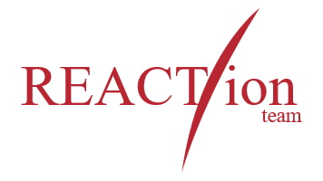
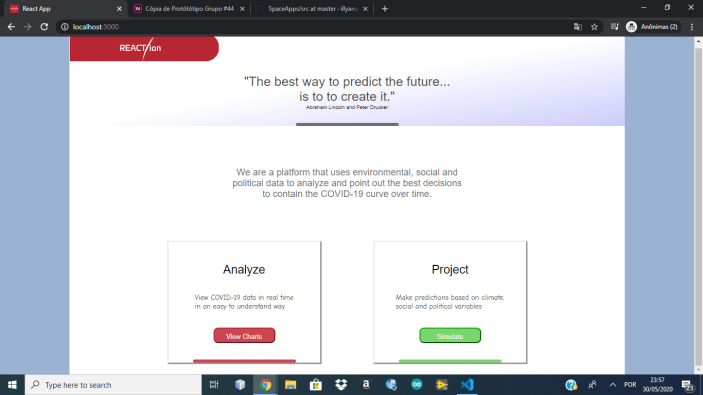
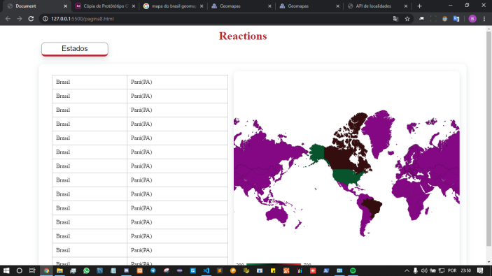
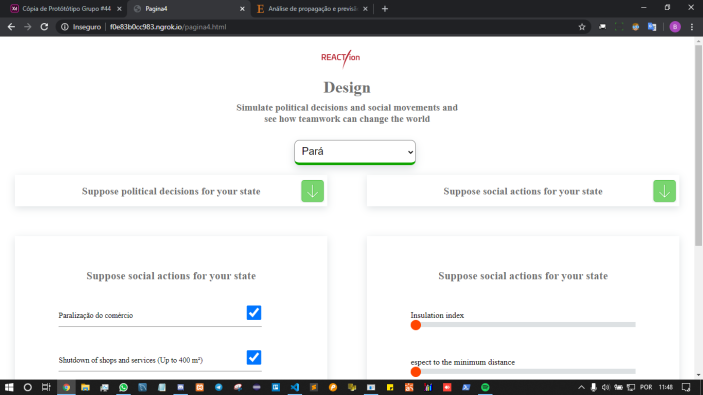
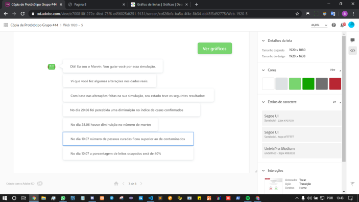

# REACTion Project

This site is being developed to meet the challenge "Where there is a link, there is a path" from the SpaceApps hackathon. 
We want to help in distributing public resources and in deciding on policy measures to contain the pandemic. 
This will be possible through a website that lists political, social and environmental data and from there makes predictions.

## Prototype

We want our platform to be able to forecast data from around the world. 
We have here, the prototype of what our screens would look like at the end of this stage

## Our pitch is available at the link:

https://www.youtube.com/watch?v=Hkukbg-Gnxw

## Our bases

Based on research done during the hackathon and more news that we see in the newspapers, 
we were able to find some formulas that have already been made to predict data about the pandemic.
Our idea is to refine these formulas through regression, and adding environmental and political variables. 
These variables will be defined from a confusion matrix. 
We will refine the formulas and carry out tests throughout the pandemic, 
and it is clear that the platform can always be updated to help predict future situations after that period.
